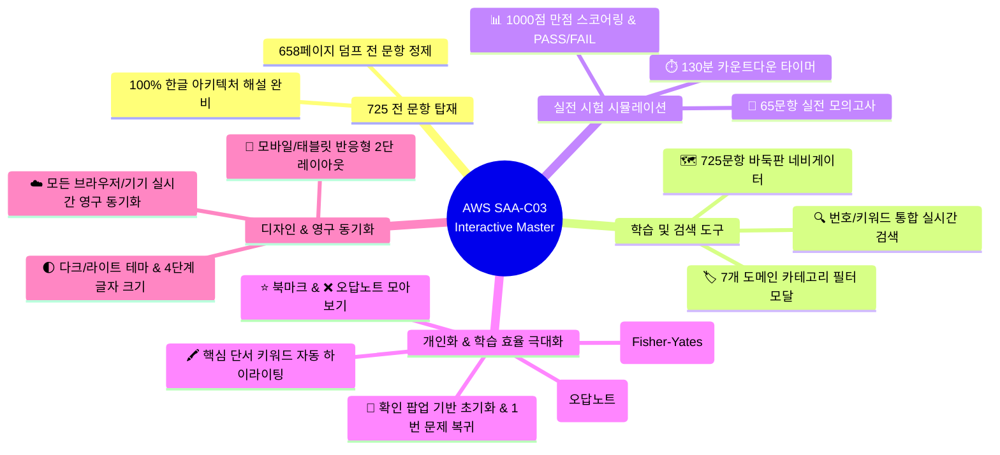

# ☁️ AWS SAA-C03 Interactive Master (725 Questions)

AWS Certified Solutions Architect - Associate (**SAA-C03**) 자격증 취득을 위한 **725개 전 문항 기출 인터랙티브 학습 & 실전 모의고사 웹 플랫폼**입니다.

PC 웹 브라우저는 물론, 동일한 Wi-Fi 환경에 연결된 **스마트폰(iPhone, Galaxy) 및 태블릿(iPad, Galaxy Tab)**에서 완벽하게 반응형으로 학습할 수 있습니다.

---

## 🚀 빠른 시작 (실행 방법)

### 1. 🌟 백그라운드 무소음 실행 (IDE 없이 상시 서빙 유지 - 강력 추천!)
`start_background.bat` 파일을 더블 클릭하면 콘솔 창 없이 백그라운드에서 조용히 실행됩니다.  
**IDE 창을 닫아도 서버가 계속 유지**되므로 스마트폰이나 태블릿으로 언제든 자유롭게 접속할 수 있습니다.
- **서버 시작**: `start_background.bat` 더블 클릭
- **서버 종료**: `stop_server.bat` 더블 클릭

### 2. 일반 원클릭 실행 (Windows)
`run_quiz.bat` 파일을 더블 클릭하면 로컬 웹 서버가 켜지며 기본 웹 브라우저에서 자동으로 열립니다.

### 3. 파이썬 직접 실행
```bash
python app.py
```

### 4. 터미널 CLI 퀴즈 모드
```bash
python quiz_cli.py
```

---

## 📱 기기별 접속 주소

| 기기 구분 | 접속 URL | 설명 |
| :--- | :--- | :--- |
| 💻 **내 PC** | **`http://localhost:5000`** | PC 웹 브라우저(Chrome, Edge 등) 접속 |
| 📱 **스마트폰 / 태블릿** | **`http://[내 PC IP]:5000`** <br>*(예: `http://172.30.1.3:5000`)* | 동일한 Wi-Fi에 연결된 모바일 기기 접속 |

> 💡 **참고**: `app.py` 또는 `run_quiz.bat` 실행 시 콘솔에 모바일 접속용 Wi-Fi 주소가 자동으로 감지되어 출력됩니다.

---

## ✨ 주요 기능 및 특징



### 1. 🗺️ 725문항 바둑판 네비게이터
- 725개 모든 문제의 풀이 상태를 색상별로 한눈에 확인:
  - 🟢 **맞은 문제** | 🔴 **틀린 문제** | ⚪ **미응시** | ⭐ **북마크** | 📝 **메모한 문제**
- 원하는 번호를 클릭하면 해당 문제로 **즉시 순간이동**합니다.

### 2. 🎯 65문항 실전 모의고사 모드
- 실제 시험과 동일하게 **전체 문제 중 무작위 65문제를 추출**하고 **130분 카운트다운 타이머**가 작동합니다.
- 시험 종료 시 실제 AWS 채점 기준인 **100~1000점 환산 점수(720점 이상 합격)** 및 합격(PASS) / 불합격(FAIL) 결과 리포트가 발급됩니다.

### 3. 🔍 실시간 검색창 & `[🔍 검색]` 버튼
- **문항 번호 검색**: `150`, `Q300` 등을 입력하고 검색 시 해당 문제로 바로 이동
- **키워드 검색**: `DynamoDB`, `Transit Gateway`, `Snowball` 등을 검색 시 관련 문항들만 즉시 필터링

### 4. 🔀 진짜 무작위 보기 셔플 (Fisher-Yates 난수 알고리즘)
- **A, B, C, D 번호표 위치는 단정하게 고정**된 상태에서, **지문 내용만 매번 새로운 난수로 무작위 셔플**됩니다.
- 셔플을 끄면 언제든지 원본의 정규 순서(`A -> B -> C -> D`)로 100% 원상 복구됩니다.

### 5. 📝 나만의 메모 & 🖍️ 핵심 단서 키워드 하이라이팅
- 각 문제마다 나만의 핵심 정리나 오답 이유를 메모(`N` 키)할 수 있으며 서버에 자동 저장됩니다.
- `최소한의 운영 오버헤드`, `가장 비용 효율적`, `밀리초 미만`, `다중 AZ` 등 정답 단서 키워드를 노란색으로 자동 강조합니다.

### 6. 📱 모바일 & 태블릿 반응형 2단 레이아웃
- 상단 1단: `[🗺️ 문항목록 (725)]`, `[🎯 모의고사 (65)]` 대형 터치 버튼
- 하단 2단: `[전체]`, `[⭐ 북마크]`, `[❌ 오답노트]`, `[📝 메모]`, `[🏷️ 주제별 태그]` 부드러운 가로 스와이프 필터

### 7. 🎧 스마트 음성 낭독 (TTS) & 핸즈프리 팟캐스트 모드
- **Web Speech API 네이티브 탑재**: 별도 서버 부하나 유료 API 비용 없이 브라우저 내장 초고속 음성 합성 지원
- **AWS 전문 용어 발음 교정 필터**: `EC2` -> "이씨투", `S3` -> "에스쓰리", `ALB` -> "에이엘비", `Multi-AZ` -> "멀티 에이지" 등 50여 개 AWS 기술 용어 자연 낭독
- **📻 팟캐스트 모드 (출퇴근/운동 핸즈프리 학습)**:
  `[문제 낭독] ➔ [4초 생각 시간 카운트다운] ➔ [정답 & 해설 낭독] ➔ [다음 문제 자동 이동]`
- **배속 조절**: `1.0x` / `1.2x` / `1.5x` 즉시 전환 및 로컬 설정 영구 기억

### 8. ☁️ 실시간 영구 동기화 (`user_progress.json`)
- 풀이 기록, 오답, 북마크, 메모, 설정(테마, 글자크기)이 로컬 서버 파일에 실시간 저장되어 **크롬, 엣지, 스마트폰, 태블릿 어디서든 동일한 진도를 공유**합니다.

---

## ⌨️ 키보드 단축키 안내 (PC)

| 단축키 | 기능 설명 |
| :--- | :--- |
| `1` ~ `4` 또는 `A`, `C`, `D` | 보기 1~4번 (또는 A, C, D) 선택 |
| `Space` 또는 `→` | 다음 문제로 이동 |
| `←` | 이전 문제로 이동 |
| `T` | 🔊 문제 음성 낭독 (TTS) 재생 / 정지 |
| `P` | 📻 핸즈프리 연속 팟캐스트 모드 시작 / 정지 |
| `B` | 북마크 저장 / 해제 |
| `N` | 나만의 학습 메모 창 열기 / 닫기 |
| `E` | 상세 해설 보기 / 숨기기 |

---

## 📂 프로젝트 파일 구조

```text
saa-lab/
├── index.html                   # 반응형 인터랙티브 웹 플랫폼 프론트엔드
├── app.py                       # REST API & Wi-Fi IP 자동 감지 파이썬 웹 서버
├── quiz_data.json               # 725개 전 문항 구조화 데이터 및 정제된 해설
├── user_progress.json           # 사용자 풀이 기록, 북마크, 메모 저장소 (영구 동기화)
├── start_background.bat         # IDE 없이 백그라운드 무소음 실행 런처
├── stop_server.bat              # 백그라운드 서버 종료 스크립트
├── run_quiz.bat                 # Windows 원클릭 실행 런처
├── quiz_cli.py                  # 터미널 CLI 퀴즈 도구
├── parse_all_questions.py       # PDF 덤프 전 문항 파싱 및 태깅 스크립트
├── conversation_export.md       # 전체 개발 및 학습 세션 대화록 (Markdown)
├── conversation_export.html     # 전체 대화록 웹 뷰어 (인쇄/PDF 저장 지원)
└── README.md                    # 프로젝트 전체 가이드 문서
```

---

## 📄 License & Attribution
- 본 도구는 개인 학습용으로 제작된 AWS SAA-C03 인터랙티브 학습 플랫폼입니다.
